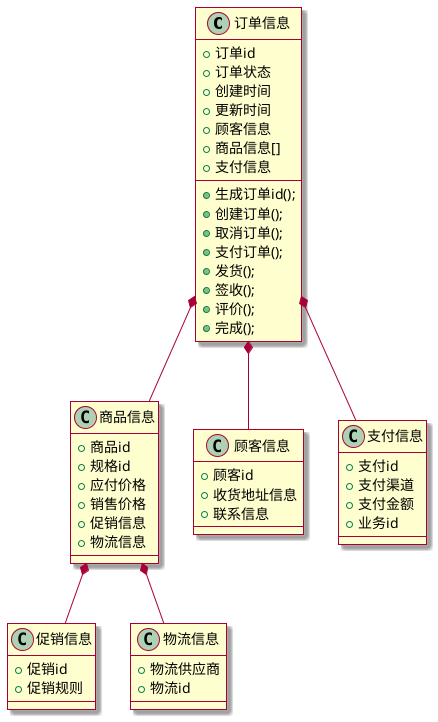
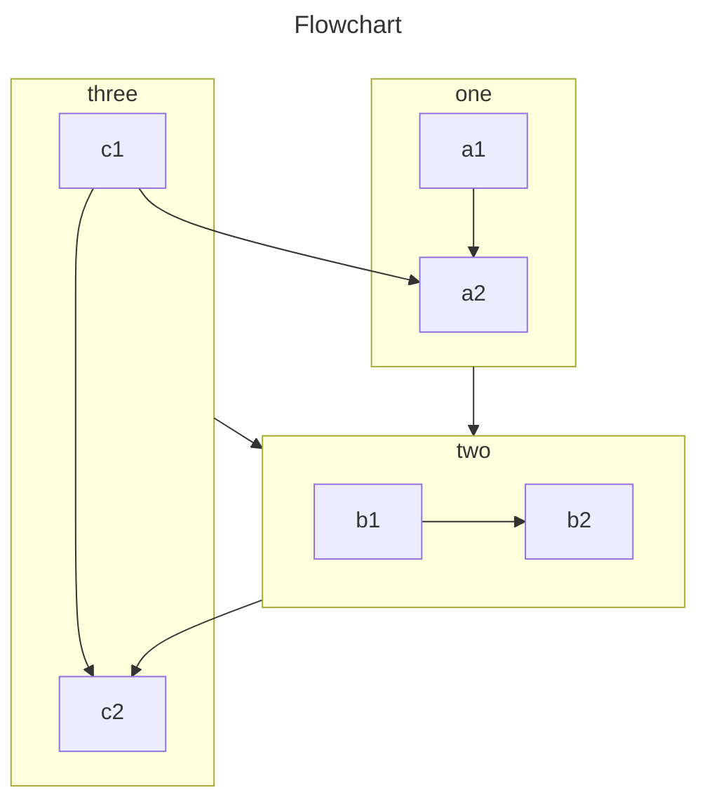

# 电商订单设计方案

## 电商订单的职责

1. 电商订单是记录电商平台上的交易信息的重要数据实体，包括订单号、商品信息、收货地址、支付信息等。
2. 电商订单具有以下职责：
   - 记录并管理交易信息：电商订单负责记录和管理商品信息、支付信息、物流信息等交易相关数据。
   - 控制交易流程：电商订单可以根据订单状态控制交易流程，如待支付、已支付、待发货、已发货、已完成等。
   - 支持订单查询和统计：电商订单可以提供订单查询和统计功能，以便用户和商家进行订单管理、交易分析等操作。
   - 支持订单修改和取消：电商订单可以支持用户和商家对订单进行修改和取消操作，以满足不同业务场景的需求。
   - 保证订单安全和隐私：电商订单需要采取相应的安全措施，确保订单信息的安全性和隐私性。
3. 电商订单的实现可以采用数据库存储、API接口调用等方式，具体的实现方式根据业务需求和系统架构进行选择。

[电商业务流程时序.md](%E7%94%B5%E5%95%86%E4%B8%9A%E5%8A%A1%E6%B5%81%E7%A8%8B%E6%97%B6%E5%BA%8F.md)

